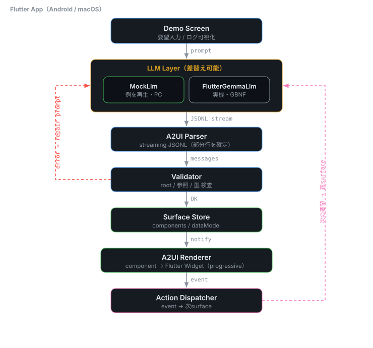

# On-Device LLM × A2UI — Flutter デモ

**クラウドに一切つながず、端末内の小型LLMが「UI そのもの」を生成して操作可能にする** Flutter デモ。

LLM の出力を *文章* ではなく **A2UI v0.9 プロトコルの JSON（操作可能なUI記述）** として受け取り、
その場で実 Flutter ウィジェットに描画します。題材は **カスタマーサポート対応コンソール**。

> 勉強会発表用に作成。オンデバイス推論（[`flutter_gemma`](https://pub.dev/packages/flutter_gemma) /
> Gemma 3n・Qwen 等）への差し替えを前提に、LLM とレンダラーを疎結合に設計しています。

---

## 何がうれしいか

| | |
|---|---|
| ✈️ **オフライン** | 機内モードのまま動く（プライバシー / 低レイテンシ / オフライン耐性） |
| 🧩 **A2UI** | LLM の出力が *操作可能なUI* になる（Agent-to-UI） |
| ⚡ **progressive rendering** | `root` が届いた時点で描画開始。生成が遅い端末ほど体感が活きる |
| 🔌 **差し替え可能なLLM** | `MockLlm`（どの端末でも即動く）↔ 実機推論をインターフェースで切替 |

## デモの流れ

```
自然言語の要望 → 端末内LLM → A2UI JSONL（ストリーム）→ パース → 検証 → 描画 → 操作
```

プリセット要望（請求の問い合わせ / 解約の申し出 / ログイン障害）をワンタップで切り替えると、
要望ごとに異なるサポート対応画面が組み上がります。

## 動かし方

```bash
flutter pub get
flutter run -d macos      # デスクトップで Mock LLM 動作（実機・モデル不要）
flutter test              # コア + レンダラーのテスト
```

> 既定の LLM は `MockLlm`（用意済みシナリオの JSONL を再生）。アプリ上部の
> **Mock ↔ Gemma トグル**で実機オンデバイス推論（`FlutterGemmaLlm`）に切替できる。

### 実機オンデバイス推論（Gemma 4 E2B）で動かす

`flutter_gemma` で **Gemma 4 E2B（LiteRT-LM, 2.4GB, 認証不要）** を端末上で実行します。
既定モデルは公式 `litert-community/gemma-4-E2B-it-litert-lm`（gated でない）なので
**トークン不要**です。

```bash
flutter run -d <ANDROID_DEVICE_ID>     # 既定で Gemma 4 E2B（token不要）
```

- アプリ起動後、上部の **「Gemma」** を選ぶ → 初回DL（2.4GB・進捗ダイアログ）→ 実機推論に切替
- 小型モデルでも、**M1 簡約プロンプト + M2 自己修正**で構造化A2UIが安定
- トグルは Mock に戻せるので、**当日トラブル時も Mock で完走**できる

**実機検証済み（Pixel 8a）**: Column / InquiryHeader / ConversationThread / ReplyBox を
正しく入れ子にした valid な A2UI を生成。ロード ~15–55s（GPU初期化込み）/ 初トークン ~3–6s。

#### モデルを使い回す（再ダウンロードを避ける）

`flutter run`（更新インストール）なら一度DLすれば `flutter_gemma` がキャッシュし再利用します
（クリーン再インストールする `flutter test` ではデータが消えて再DLになる点に注意）。

確実に使い回すなら、モデルを端末の安定パスへ置いて `fromFile` で読みます:

```bash
flutter run -d <device>              # 先に一度インストール
scripts/push_gemma_model.sh <device> # Mac のモデルを端末へ push（無ければ自動DL）
# → アプリで「Gemma」を選ぶと fromFile でロード（再DLなし）
```

`GEMMA_MODEL_PATH` を `--dart-define` で渡せば任意パスから読めます（既定はアプリ外部 files）。

発表スライド（外部依存なし・オフライン動作の単体HTML、実機スクショ埋め込み済み）:

```bash
open docs/slides.html
```

### 実機スクリーンショット（自動撮影）

Android 実機を操作して各状態のスクショを `screenshots/` に出力します（finder 駆動で再現性あり）。
端末がスリープすると撮影が止まるため、撮影中は画面を点灯させておきます。

```bash
adb shell svc power stayon usb          # 撮影中スリープ防止
flutter drive \
  --driver=test_driver/integration_test.dart \
  --target=integration_test/app_screenshots_test.dart -d <DEVICE_ID>
```

## アーキテクチャ



中心思想は **LLM とレンダラーを疎結合に**すること。重く環境依存な LLM 側を
`LlmBackend` インターフェースの裏に隠し、レンダラー側はどの端末でも・Mock でも動かせます。

詳細は [`docs/design.md`](docs/design.md)、図のソースは [`docs/architecture.drawio`](docs/architecture.drawio)。

### ディレクトリ構成

```
lib/
  core/a2ui/        A2UI コア（LLM 非依存）
    message/        4種メッセージ（createSurface / updateComponents / updateDataModel / deleteSurface）
    component/      コンポーネント（隣接リスト = フラット配列 + id 参照）
    parser/         streaming JSONL パーサ（部分行を確定・非JSON行をスキップ）
    state/          JSON Pointer データモデル / Surface / SurfaceStore
  core/llm/         LlmBackend（差替可）+ MockLlm + プロンプト資産
  ui/renderer/      隣接リスト → Flutter ウィジェット木（循環参照・未定義ID・深さガード）
  ui/screen/        デモ画面（入力 / プリセット / 生成速度 / progressive描画 / ログ）
docs/               設計ドキュメント・発表スライド・アーキテクチャ図
test/               DataModel / パーサ / Mock統合 / レンダラー描画
```

## A2UI プロトコル（v0.9・要約）

- **JSONL**（1行 = 1メッセージ）。各メッセージはトップレベルキー1つで判別。
- コンポーネントは **フラット配列**で、親子は **id 参照**（隣接リスト）。`root` が必ず1つ。
- 動的値は **JSON Pointer**（`{"path":"/reply/draft"}`）で参照し、`updateDataModel` で実データを別送。

```jsonc
{"version":"v0.9","createSurface":{"surfaceId":"s","catalogId":"https://example.com/catalog/support"}}
{"version":"v0.9","updateComponents":{"surfaceId":"s","components":[
  {"id":"root","component":"Column","children":["header","reply"]},
  {"id":"header","component":"InquiryHeader","customer":"…","subject":"…","status":"open","priority":"high"},
  {"id":"reply","component":"ReplyBox","value":{"path":"/reply/draft"}}
]}}
{"version":"v0.9","updateDataModel":{"surfaceId":"s","path":"/reply/draft","value":"…"}}
```

### カタログ（`support`）

basic カタログを「自社デザインシステム」に差し替えた例。`catalogId` を独自URIにし、
コンポーネント定義を専用のものへ置き換えています。

- レイアウト: `Column` / `Row` / `Card` / `Text`
- サポート専用: `InquiryHeader` / `CustomerProfileCard` / `ConversationThread` /
  `StatusBadge` / `PriorityTag` / `SlaIndicator` / `KnowledgeSuggestion` /
  `CannedResponsePicker` / `ReplyBox` / `QuickActions`

## ロードマップ

- [x] A2UI コア（メッセージ / 隣接リスト / streaming パーサ / JSON Pointer）
- [x] レンダラー + `support` 独自カタログ + `MockLlm`（macOS で動作）
- [x] プリセット要望 / 複数シナリオ / progressive 演出 / オフライン演出
- [x] Validator + 自己修正ループ（不正JSON → repair プロンプト → 再生成、上限付き）
- [x] **実機オンデバイス推論**（`flutter_gemma` / Gemma 3n E2B・Android）。UI で Mock ↔ Gemma 切替
- [ ] 制約付きデコード（GBNF）で小型モデルの JSON 破綻を抑制

## ライセンス / 補足

- A2UI は v0.9（draft）。本リポジトリはプロトコルの**一例の実装**です。
- 登場する顧客名・ドメイン（`example.com` 等）はすべてダミーです。
